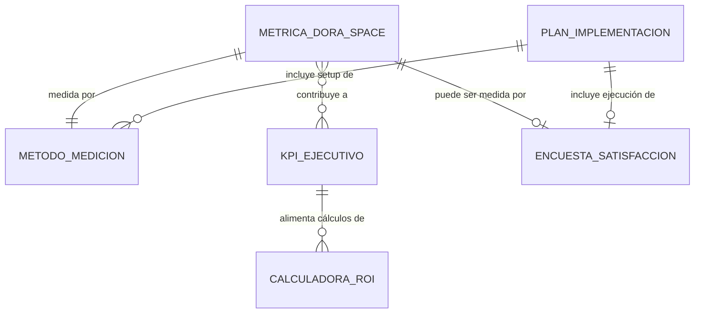

# Modelo de Datos: Framework de Observabilidad del Impacto de IA para Flutter

**Fase**: 1 (Diseño & Contratos)
**Fecha**: 2025-11-13
**Propósito**: Definir las entidades clave, sus atributos, relaciones y reglas de validación

## Visión General

Este documento define el modelo de datos del framework de observabilidad. Las entidades principales son: **Métrica DORA/SPACE**, **KPI Ejecutivo**, **Método de Medición**, **Calculadora de ROI**, **Encuesta de Satisfacción**, y **Plan de Implementación**. Todas las entidades están diseñadas para ser serializables en JSON y almacenables como archivos Markdown estructurados.

---

## Entidad 1: Métrica DORA/SPACE

### Descripción
Representa una medida cuantitativa o cualitativa del rendimiento del equipo o del negocio. Cada métrica mapea a una categoría DORA (Lead Time, Deployment Frequency, Change Failure Rate, MTTR) o una dimensión SPACE (Satisfaction, Performance, Activity, Communication, Efficiency).

### Atributos

| Atributo | Tipo | Obligatorio | Descripción | Validación |
|----------|------|-------------|-------------|------------|
| `id` | String | Sí | Identificador único (e.g., "DORA-LT-001") | Patrón: `[DORA\|SPACE]-[CÓDIGO]-[###]` |
| `categoria` | Enum | Sí | Categoría DORA o dimensión SPACE | Valores: `DORA_LEAD_TIME`, `DORA_DEPLOY_FREQ`, `DORA_CFR`, `DORA_MTTR`, `SPACE_SATISFACTION`, `SPACE_PERFORMANCE`, `SPACE_ACTIVITY`, `SPACE_COMMUNICATION`, `SPACE_EFFICIENCY` |
| `nombre` | String | Sí | Nombre descriptivo de la métrica | Máximo 100 caracteres |
| `descripcion` | String | Sí | Explicación de qué mide esta métrica | Máximo 500 caracteres |
| `adaptacionFlutter` | String | Sí | Cómo esta métrica es única o crítica en Flutter | Máximo 1000 caracteres, debe mencionar conceptos Flutter-específicos |
| `metodoMedicion` | Object (ver Método de Medición) | Sí | Referencia al procedimiento de medición | Debe existir un método de medición asociado |
| `baselineComun` | Object | No | Valor típico para equipos sin IA | `{ valor: Number/String, unidad: String }` |
| `targetConIA` | Object | No | Valor esperado con adopción de IA | `{ valor: Number/String, unidad: String }` |
| `impactoEsperado` | Number | Sí | Porcentaje de mejora proyectado | Rango: 0-100, típicamente 20-60% |
| `criticidadFlutter` | Enum | Sí | Qué tan crítica es esta métrica para Flutter vs otras plataformas | Valores: `BAJA`, `MEDIA`, `ALTA`, `CRÍTICA` |
| `relacionesKPI` | Array<String> | No | IDs de KPIs ejecutivos que dependen de esta métrica | Referencias a `KPI Ejecutivo.id` |
| `fechaCreacion` | DateTime | Sí | Cuándo se agregó esta métrica al framework | ISO 8601 format |
| `versionFramework` | String | Sí | Versión del framework cuando se agregó | SemVer format (e.g., "1.0.0") |

### Ejemplo de Instancia (JSON)

```json
{
  "id": "SPACE-EFF-001",
  "categoria": "SPACE_EFFICIENCY",
  "nombre": "Tiempo de Build en CI (Flutter Multiplataforma)",
  "descripcion": "Tiempo promedio desde push de código hasta disponibilidad de artefactos compilados para Android e iOS en pipeline de CI/CD.",
  "adaptacionFlutter": "Flutter requiere compilación AOT para iOS (10-20 min) y JIT/AOT para Android (8-18 min). A diferencia de desarrollo web (segundos), los builds lentos causan context switching significativo y reducción de flow state. Hot reload mitiga esto en desarrollo local, pero CI builds siguen siendo críticos para testing y releases.",
  "metodoMedicion": {
    "id": "MET-CI-001",
    "herramienta": "GitHub Actions / Bitrise / Codemagic",
    "comandos": "Extraer 'Total duration' de logs de CI para jobs de build de Flutter",
    "frecuencia": "PER_BUILD"
  },
  "baselineComun": {
    "valor": 15,
    "unidad": "minutos"
  },
  "targetConIA": {
    "valor": 13,
    "unidad": "minutos"
  },
  "impactoEsperado": 15,
  "criticidadFlutter": "ALTA",
  "relacionesKPI": ["KPI-002"],
  "fechaCreacion": "2025-11-13T00:00:00Z",
  "versionFramework": "1.0.0"
}
```

### Reglas de Validación

1. **Consistencia de Impacto**: Si `impactoEsperado` > 0, entonces `targetConIA.valor` debe ser mejor que `baselineComun.valor` (dirección depende de la métrica: tiempo → menor, porcentaje → mayor)
2. **Categoría Flutter**: `adaptacionFlutter` debe contener al menos uno de: "Flutter", "Dart", "Widget", "hot reload", "AOT", "JIT", "iOS", "Android"
3. **Método Obligatorio**: `metodoMedicion` no puede ser null para métricas con `criticidadFlutter` = `ALTA` o `CRÍTICA`

### Relaciones

- **1:1 con Método de Medición**: Cada métrica tiene exactamente un método primario de medición
- **N:M con KPI Ejecutivo**: Una métrica puede contribuir a múltiples KPIs, un KPI puede depender de múltiples métricas

---

## Entidad 2: KPI Ejecutivo

### Descripción
Representa un indicador clave de rendimiento del dashboard para presentaciones a CTO/CFO. Cada KPI traduce una o más métricas técnicas a impacto financiero (costo de inacción en dólares/año).

### Atributos

| Atributo | Tipo | Obligatorio | Descripción | Validación |
|----------|------|-------------|-------------|------------|
| `id` | String | Sí | Identificador único (e.g., "KPI-001") | Patrón: `KPI-[###]` |
| `nombre` | String | Sí | Título ejecutivo del KPI | Máximo 80 caracteres, debe ser accionable (e.g., "Costo de Onboarding Lento") |
| `descripcionEjecutiva` | String | Sí | Explicación en lenguaje de negocio, no técnico | Máximo 300 caracteres, sin jerga técnica |
| `metricasSubyacentes` | Array<String> | Sí | IDs de métricas DORA/SPACE que componen este KPI | Mínimo 1 métrica |
| `calculoCostoAnual` | Object | Sí | Fórmula y parámetros para calcular costo | Ver estructura abajo |
| `costoBaselineDolares` | Number | Sí | Costo anual actual sin IA (USD) | Debe ser > 0 |
| `ahorroProyectadoDolares` | Number | Sí | Ahorro anual esperado con IA (USD) | Debe ser ≥ 0 y ≤ costoBaselineDolares |
| `visualizacionSugerida` | Enum | Sí | Tipo de gráfico recomendado | Valores: `BAR_CHART`, `PIE_CHART`, `LINE_CHART`, `GAUGE`, `TIMELINE` |
| `ejemploVisualizacion` | String | No | Descripción textual o path a mockup de visualización | Máximo 500 caracteres |
| `narrativaCostoInaccion` | String | Sí | Frase de impacto para presentación ejecutiva | Máximo 200 caracteres, debe incluir cifra en dólares |
| `prioridad` | Integer | Sí | Orden en dashboard ejecutivo (1 = más crítico) | Rango: 1-5 (solo 5 KPIs permitidos) |
| `audienciaObjetivo` | Array<Enum> | Sí | Quién debe ver este KPI | Valores: `CTO`, `CFO`, `VP_ENGINEERING`, `CEO` |

### Estructura de `calculoCostoAnual`

```json
{
  "formula": "String describiendo cálculo",
  "parametros": {
    "tamañoEquipo": { "tipo": "Number", "default": 20, "descripcion": "Número de developers" },
    "salarioPromedio": { "tipo": "Number", "default": 150000, "descripcion": "Salario anual USD" },
    "porcentajeTiempo": { "tipo": "Number", "default": 0.35, "descripcion": "% de tiempo en actividad" },
    // ... parámetros adicionales específicos del KPI
  },
  "ejemploCalculo": "728 horas/año × $72/hora × 20 devs = $1,048,320"
}
```

### Ejemplo de Instancia (JSON)

```json
{
  "id": "KPI-002",
  "nombre": "Costo de Boilerplate y Tareas Repetitivas",
  "descripcionEjecutiva": "Porcentaje del tiempo del equipo gastado en código repetitivo (StatefulWidgets, Models, JSON serialization) que no diferencia el producto.",
  "metricasSubyacentes": ["SPACE-EFF-002", "SPACE-PERF-001"],
  "calculoCostoAnual": {
    "formula": "(Horas anuales × % en boilerplate) × Costo horario × Tamaño equipo",
    "parametros": {
      "horasAnuales": { "tipo": "Number", "default": 2080, "descripcion": "Horas laborables/año" },
      "porcentajeBoilerplate": { "tipo": "Number", "default": 0.35, "descripcion": "35% del tiempo" },
      "salarioPromedio": { "tipo": "Number", "default": 150000, "descripcion": "USD/año" },
      "tamañoEquipo": { "tipo": "Number", "default": 20, "descripcion": "Developers Flutter" }
    },
    "ejemploCalculo": "2080 × 0.35 = 728h/dev → $150K ÷ 2080 = $72/h → 728 × $72 × 20 = $1,048,320"
  },
  "costoBaselineDolares": 1048320,
  "ahorroProyectadoDolares": 628992,
  "visualizacionSugerida": "PIE_CHART",
  "ejemploVisualizacion": "Gráfico de pastel mostrando 35% del tiempo en boilerplate (rojo) vs 65% en features (verde), con callout de '$628K/año recuperables con IA'",
  "narrativaCostoInaccion": "Su equipo gasta $1M/año en código que la IA puede generar. Recupere $629K adoptando herramientas de generación automática.",
  "prioridad": 1,
  "audienciaObjetivo": ["CTO", "CFO", "VP_ENGINEERING"]
}
```

### Reglas de Validación

1. **Suma de Prioridades**: Solo puede haber exactamente 5 KPIs con prioridades 1-5 (sin duplicados)
2. **Consistencia de Ahorro**: `ahorroProyectadoDolares` ≤ `costoBaselineDolares`
3. **Narrativa Financiera**: `narrativaCostoInaccion` debe contener al menos un número con formato de moneda (e.g., "$629K", "$1M")
4. **Métricas Válidas**: Todos los IDs en `metricasSubyacentes` deben existir en la colección de Métricas DORA/SPACE

---

## Entidad 3: Método de Medición

### Descripción
Representa un procedimiento concreto para capturar datos de una métrica. Define qué herramienta usar, comandos específicos, frecuencia de medición, y esfuerzo requerido.

### Atributos

| Atributo | Tipo | Obligatorio | Descripción | Validación |
|----------|------|-------------|-------------|------------|
| `id` | String | Sí | Identificador único (e.g., "MET-GIT-001") | Patrón: `MET-[TIPO]-[###]` |
| `tipo` | Enum | Sí | Categoría del método | Valores: `AUTOMATIZADO_GIT`, `AUTOMATIZADO_CI`, `OBSERVABILIDAD`, `ENCUESTA`, `MANUAL` |
| `herramienta` | String | Sí | Nombre de la herramienta o servicio | e.g., "Git", "Firebase Crashlytics", "Google Forms" |
| `comandosQuery` | String | No | Comandos exactos o queries para extraer datos | Requerido si tipo = `AUTOMATIZADO_*`, formato código |
| `frecuencia` | Enum | Sí | Con qué frecuencia se debe medir | Valores: `PER_COMMIT`, `PER_BUILD`, `DAILY`, `WEEKLY`, `MONTHLY`, `QUARTERLY` |
| `outputEsperado` | String | Sí | Descripción del formato de datos resultante | e.g., "CSV con columnas: commit_hash, timestamp, author" |
| `esfuerzoImplementacion` | Object | Sí | Tiempo requerido para setup inicial | `{ horas: Number, skillLevel: Enum }` donde skillLevel = `JUNIOR`, `MID`, `SENIOR` |
| `prerequisitos` | Array<String> | No | Herramientas o accesos necesarios | e.g., ["GitHub Admin access", "Firebase project setup"] |
| `ejemploPaso a Paso` | Array<Object> | No | Guía de implementación | `[{ paso: Number, accion: String, comandoEjemplo: String }]` |

### Ejemplo de Instancia (JSON)

```json
{
  "id": "MET-GIT-001",
  "tipo": "AUTOMATIZADO_GIT",
  "herramienta": "Git",
  "comandosQuery": "git log --pretty=format:'%H,%an,%ad,%s' --date=iso --since='6 months ago' | grep -E '(feature|fix|release)' > lead-time-data.csv",
  "frecuencia": "WEEKLY",
  "outputEsperado": "Archivo CSV con columnas: commit_hash, author, timestamp, message. Luego calcular delta entre commits de feature y tags de release.",
  "esfuerzoImplementacion": {
    "horas": 2,
    "skillLevel": "MID"
  },
  "prerequisitos": [
    "Acceso de lectura al repositorio Git",
    "Git CLI instalado",
    "Convención de commits con prefijos feature/fix/release"
  ],
  "ejemploPasoAPaso": [
    {
      "paso": 1,
      "accion": "Clonar repositorio localmente",
      "comandoEjemplo": "git clone https://github.com/org/flutter-app.git"
    },
    {
      "paso": 2,
      "accion": "Ejecutar comando de extracción",
      "comandoEjemplo": "cd flutter-app && git log --pretty=format:'%H,%an,%ad,%s' --date=iso --since='6 months ago' > ../lead-time-data.csv"
    },
    {
      "paso": 3,
      "accion": "Analizar CSV con script de análisis",
      "comandoEjemplo": "python analyze_lead_time.py lead-time-data.csv"
    }
  ]
}
```

### Reglas de Validación

1. **Comandos Obligatorios**: Si `tipo` = `AUTOMATIZADO_GIT` o `AUTOMATIZADO_CI`, entonces `comandosQuery` no puede estar vacío
2. **Frecuencia Realista**: Si `tipo` = `ENCUESTA`, entonces `frecuencia` debe ser `MONTHLY` o `QUARTERLY` (no más frecuente)
3. **Esfuerzo Razonable**: `esfuerzoImplementacion.horas` debe estar en rango 0.5-40 horas (si >40, reconsiderar si es demasiado complejo)

---

## Entidad 4: Calculadora de ROI

### Descripción
Representa un modelo financiero parametrizado que calcula ROI, payback period, y NPV basado en entradas del usuario (tamaño de equipo, salarios, costos de herramientas).

### Atributos

| Atributo | Tipo | Obligatorio | Descripción | Validación |
|----------|------|-------------|-------------|------------|
| `id` | String | Sí | Identificador único (e.g., "CALC-ROI-001") | Patrón: `CALC-[TIPO]-[###]` |
| `nombre` | String | Sí | Nombre descriptivo de la calculadora | e.g., "Calculadora de ROI para Adopción de GitHub Copilot" |
| `parametrosEntrada` | Array<Object> | Sí | Inputs que el usuario puede configurar | Ver estructura abajo |
| `formulasCalculo` | Object | Sí | Fórmulas para cada output financiero | `{ roi: String, payback: String, npv: String }` |
| `outputsEsperados` | Array<Object> | Sí | Resultados que la calculadora produce | Ver estructura abajo |
| `valoresDefault` | Object | Sí | Valores pre-cargados para caso típico | Mapa de `parametroId` → `valorDefault` |
| `rangosSensibilidad` | Object | No | Rangos para análisis "qué pasa si" | e.g., `{ mejoraIA: [0.3, 0.45, 0.6] }` |

### Estructura de `parametrosEntrada`

```json
[
  {
    "id": "tamañoEquipo",
    "label": "Tamaño del Equipo Flutter",
    "tipo": "Number",
    "unidad": "developers",
    "min": 1,
    "max": 100,
    "default": 20,
    "descripcion": "Número de developers Flutter en el equipo"
  },
  {
    "id": "salarioPromedio",
    "label": "Salario Promedio Anual",
    "tipo": "Number",
    "unidad": "USD",
    "min": 50000,
    "max": 300000,
    "default": 150000,
    "descripcion": "Salario anual promedio del equipo"
  }
  // ... más parámetros
]
```

### Estructura de `outputsEsperados`

```json
[
  {
    "id": "roiPorcentaje",
    "label": "ROI (%)",
    "tipo": "Number",
    "formato": "percentage",
    "descripcion": "Retorno sobre inversión expresado como porcentaje"
  },
  {
    "id": "paybackDias",
    "label": "Payback Period",
    "tipo": "Number",
    "formato": "days",
    "descripcion": "Días hasta recuperar la inversión"
  }
  // ... más outputs
]
```

### Ejemplo de Instancia (JSON)

```json
{
  "id": "CALC-ROI-001",
  "nombre": "Calculadora de ROI: Herramientas de IA para Flutter",
  "parametrosEntrada": [
    {
      "id": "tamañoEquipo",
      "label": "Tamaño del Equipo",
      "tipo": "Number",
      "unidad": "developers",
      "min": 1,
      "max": 100,
      "default": 20
    },
    {
      "id": "salarioPromedio",
      "label": "Salario Promedio Anual",
      "tipo": "Number",
      "unidad": "USD",
      "min": 50000,
      "max": 300000,
      "default": 150000
    },
    {
      "id": "costoHerramientaMes",
      "label": "Costo de Herramienta IA por Developer",
      "tipo": "Number",
      "unidad": "USD/mes",
      "min": 0,
      "max": 100,
      "default": 39
    }
  ],
  "formulasCalculo": {
    "inversionAnual": "tamañoEquipo × costoHerramientaMes × 12",
    "ahorroAnual": "Suma de ahorros de todos los KPIs basados en mejoras esperadas",
    "roi": "((ahorroAnual - inversionAnual) / inversionAnual) × 100",
    "payback": "(inversionAnual / ahorroAnual) × 365",
    "npv": "Σ [(ahorroAnual - inversionAnual) / (1 + tasaDescuento)^año] para años 1-3"
  },
  "outputsEsperados": [
    { "id": "inversionAnual", "label": "Inversión Anual", "tipo": "Number", "formato": "currency" },
    { "id": "ahorroAnual", "label": "Ahorro Anual", "tipo": "Number", "formato": "currency" },
    { "id": "roiPorcentaje", "label": "ROI", "tipo": "Number", "formato": "percentage" },
    { "id": "paybackDias", "label": "Payback Period", "tipo": "Number", "formato": "days" },
    { "id": "npv3años", "label": "NPV (3 años)", "tipo": "Number", "formato": "currency" }
  ],
  "valoresDefault": {
    "tamañoEquipo": 20,
    "salarioPromedio": 150000,
    "costoHerramientaMes": 39,
    "tasaDescuento": 0.10
  },
  "rangosSensibilidad": {
    "mejoraIA": [0.30, 0.45, 0.60],
    "descripcion": "Escenarios: Conservador (30%), Moderado (45%), Optimista (60%)"
  }
}
```

### Reglas de Validación

1. **Outputs Financieros**: Debe incluir mínimamente `roi`, `payback`, y `npv` en `outputsEsperados`
2. **Defaults Válidos**: Todos los valores en `valoresDefault` deben cumplir con `min` y `max` de sus parámetros correspondientes
3. **Fórmulas Referenciadas**: Todas las variables en `formulasCalculo` deben existir en `parametrosEntrada` o ser constantes conocidas

---

## Entidad 5: Encuesta de Satisfacción

### Descripción
Representa un cuestionario estructurado para medir SPACE - Satisfaction. Incluye preguntas específicas de Flutter, escala de medición, y preguntas de control.

### Atributos

| Atributo | Tipo | Obligatorio | Descripción | Validación |
|----------|------|-------------|-------------|------------|
| `id` | String | Sí | Identificador único (e.g., "SURVEY-SAT-001") | Patrón: `SURVEY-[TIPO]-[###]` |
| `nombre` | String | Sí | Título de la encuesta | e.g., "Encuesta de Satisfacción del Desarrollador Flutter Q4 2025" |
| `preguntas` | Array<Object> | Sí | Lista de preguntas con configuración | Mínimo 10 preguntas, ver estructura abajo |
| `escalaMedicion` | Enum | Sí | Tipo de escala para respuestas Likert | Valores: `LIKERT_5`, `LIKERT_7`, `NPS_0_10` |
| `frecuenciaAplicacion` | Enum | Sí | Con qué frecuencia ejecutar | Valores: `MONTHLY`, `QUARTERLY`, `BIANNUAL` |
| `tiempoCompletacionMinutos` | Number | Sí | Tiempo estimado para completar | Máximo 10 minutos (validación: calcular 30 seg/pregunta) |
| `preguntasControl` | Array<String> | Sí | IDs de preguntas que aíslan factores no-tool | Mínimo 2 preguntas de control |
| `metodoAnalisis` | String | Sí | Cómo interpretar resultados | Descripción del cálculo de score promedio y correlaciones |

### Estructura de `preguntas`

```json
[
  {
    "id": "Q1",
    "orden": 1,
    "texto": "¿Cuán satisfecho estás con la confiabilidad del hot reload de Flutter?",
    "tipo": "LIKERT",
    "categoriaMetrica": "SPACE_EFFICIENCY",
    "esControlOrganizacional": false,
    "opcionesRespuesta": [
      { "valor": 1, "etiqueta": "Muy insatisfecho" },
      { "valor": 2, "etiqueta": "Insatisfecho" },
      { "valor": 3, "etiqueta": "Neutral" },
      { "valor": 4, "etiqueta": "Satisfecho" },
      { "valor": 5, "etiqueta": "Muy satisfecho" }
    ]
  },
  {
    "id": "Q9",
    "orden": 9,
    "texto": "¿Cuán satisfecho estás con el management y liderazgo de tu equipo?",
    "tipo": "LIKERT",
    "categoriaMetrica": null,
    "esControlOrganizacional": true,
    "descripcionControl": "Pregunta de control para aislar satisfacción con herramientas vs management"
  }
]
```

### Ejemplo de Instancia (JSON)

```json
{
  "id": "SURVEY-SAT-001",
  "nombre": "Encuesta de Satisfacción del Desarrollador Flutter",
  "preguntas": [
    {
      "id": "Q1",
      "orden": 1,
      "texto": "¿Cuán satisfecho estás con los tiempos de hot reload en desarrollo local?",
      "tipo": "LIKERT",
      "categoriaMetrica": "SPACE_EFFICIENCY",
      "esControlOrganizacional": false
    },
    {
      "id": "Q2",
      "orden": 2,
      "texto": "¿Qué tan clara encuentras la gestión de estado en nuestro código base? (Provider/Bloc/Riverpod)",
      "tipo": "LIKERT",
      "categoriaMetrica": "SPACE_COMMUNICATION",
      "esControlOrganizacional": false
    },
    // ... Q3-Q7: preguntas de herramientas Flutter
    {
      "id": "Q8",
      "orden": 8,
      "texto": "En una escala de 0 a 10, ¿qué tan probable es que recomiendes trabajar en desarrollo Flutter en esta empresa a un amigo?",
      "tipo": "NPS",
      "categoriaMetrica": "SPACE_SATISFACTION",
      "esControlOrganizacional": false
    },
    {
      "id": "Q9",
      "orden": 9,
      "texto": "¿Cuán satisfecho estás con el management y liderazgo de tu equipo?",
      "tipo": "LIKERT",
      "categoriaMetrica": null,
      "esControlOrganizacional": true
    },
    {
      "id": "Q10",
      "orden": 10,
      "texto": "¿Cuán satisfecho estás con tu compensación y beneficios?",
      "tipo": "LIKERT",
      "categoriaMetrica": null,
      "esControlOrganizacional": true
    }
  ],
  "escalaMedicion": "LIKERT_5",
  "frecuenciaAplicacion": "QUARTERLY",
  "tiempoCompletacionMinutos": 5,
  "preguntasControl": ["Q9", "Q10"],
  "metodoAnalisis": "Calcular score promedio de Q1-Q7 para satisfacción con herramientas. Calcular NPS de Q8. Correlacionar Q9-Q10 con Q1-Q7 para detectar si baja satisfacción es por herramientas o factores organizacionales."
}
```

### Reglas de Validación

1. **Tiempo Realista**: `tiempoCompletacionMinutos` debe ser ≤ 10 minutos para mantener completion rate >75%
2. **Balance de Preguntas**: Mínimo 60% de preguntas deben tener `esControlOrganizacional` = false (enfoque en herramientas)
3. **Preguntas de Control**: `preguntasControl` debe listar mínimo 2 preguntas con `esControlOrganizacional` = true

---

## Entidad 6: Plan de Implementación

### Descripción
Representa una hoja de ruta estructurada de 4 semanas para operacionalizar el framework de medición. Cada semana tiene actividades específicas, entregables, y criterios de éxito.

### Atributos

| Atributo | Tipo | Obligatorio | Descripción | Validación |
|----------|------|-------------|-------------|------------|
| `id` | String | Sí | Identificador único (e.g., "IMPL-PLAN-001") | Patrón: `IMPL-PLAN-[###]` |
| `fases` | Array<Object> | Sí | Semanas del plan (exactamente 4) | Longitud fija: 4 elementos |
| `duracionTotal` | Object | Sí | Duración total del plan | `{ semanas: 4, horasEstimadas: Number }` |
| `rolesRequeridos` | Array<String> | Sí | Roles necesarios en el equipo | e.g., ["Engineering Manager", "Developer", "Data Analyst"] |

### Estructura de `fases` (Fase Semanal)

```json
{
  "semana": 1,
  "nombre": "Baseline - Establecer Línea Base",
  "objetivo": "Medir estado actual sin herramientas de IA",
  "actividades": [
    {
      "id": "ACT-1-1",
      "descripcion": "Configurar extracción de métricas Git (Lead Time, Code Review Time)",
      "responsable": "Team Lead",
      "duracionHoras": 4,
      "entregable": "Script de extracción de Git + CSV de datos de últimos 6 meses"
    },
    {
      "id": "ACT-1-2",
      "descripcion": "Exportar datos de Firebase Crashlytics (Crash-free users %)",
      "responsable": "Developer",
      "duracionHoras": 2,
      "entregable": "Dashboard con crash rate de últimos 3 meses"
    }
  ],
  "entregables": [
    "Documento de baseline con valores actuales de 5 métricas clave",
    "Dashboard de métricas actuales"
  ],
  "criteriosExito": [
    "Al menos 5 métricas medidas con datos de mínimo 3 meses",
    "Datos validados por Engineering Manager"
  ]
}
```

### Ejemplo de Instancia (JSON)

```json
{
  "id": "IMPL-PLAN-001",
  "fases": [
    {
      "semana": 1,
      "nombre": "Baseline",
      "objetivo": "Establecer línea base de métricas actuales",
      "actividades": [
        {
          "id": "ACT-1-1",
          "descripcion": "Configurar analytics de Git",
          "responsable": "Team Lead",
          "duracionHoras": 4
        },
        {
          "id": "ACT-1-2",
          "descripcion": "Exportar crash data de Firebase",
          "responsable": "Developer",
          "duracionHoras": 2
        },
        {
          "id": "ACT-1-3",
          "descripcion": "Diseñar y lanzar encuesta de satisfacción",
          "responsable": "Engineering Manager",
          "duracionHoras": 3
        }
      ],
      "entregables": ["Documento de baseline con 5 métricas", "Resultados de encuesta inicial"],
      "criteriosExito": ["Mínimo 5 métricas con datos de 3+ meses", ">70% completion rate en encuesta"]
    },
    {
      "semana": 2,
      "nombre": "Instrumentación",
      "objetivo": "Setup de dashboards y automatización de métricas",
      "actividades": [
        {
          "id": "ACT-2-1",
          "descripcion": "Configurar dashboard en Grafana/Datadog con métricas DORA",
          "responsable": "DevOps Engineer",
          "duracionHoras": 8
        }
      ],
      "entregables": ["Dashboard operacional", "Alertas configuradas"],
      "criteriosExito": ["Dashboard actualizado automáticamente cada 24h"]
    },
    {
      "semana": 3,
      "nombre": "Piloto",
      "objetivo": "Piloto de herramientas IA con grupo de control",
      "actividades": [
        {
          "id": "ACT-3-1",
          "descripcion": "5 developers usan GitHub Copilot durante 2 sprints",
          "responsable": "Engineering Manager",
          "duracionHoras": 80
        }
      ],
      "entregables": ["Métricas A/B (piloto vs control)", "Feedback cualitativo de piloto"],
      "criteriosExito": ["Métricas medidas en ambos grupos", "Mínimo 3 insights accionables"]
    },
    {
      "semana": 4,
      "nombre": "Presentación",
      "objetivo": "Compilar business case y presentar a ejecutivos",
      "actividades": [
        {
          "id": "ACT-4-1",
          "descripcion": "Compilar datos en dashboard de 5 KPIs",
          "responsable": "Engineering Manager",
          "duracionHoras": 6
        },
        {
          "id": "ACT-4-2",
          "descripcion": "Preparar presentación ejecutiva con ROI calculado",
          "responsable": "CTO",
          "duracionHoras": 4
        }
      ],
      "entregables": ["Presentación ejecutiva", "Business case con proyección a 3 años"],
      "criteriosExito": ["Aprobación para rollout completo de herramientas IA"]
    }
  ],
  "duracionTotal": {
    "semanas": 4,
    "horasEstimadas": 120
  },
  "rolesRequeridos": ["Engineering Manager", "Team Lead", "Developer", "DevOps Engineer", "CTO"]
}
```

### Reglas de Validación

1. **Fases Completas**: Debe haber exactamente 4 fases con `semana` = 1, 2, 3, 4
2. **Entregables por Fase**: Cada fase debe tener al menos 1 entregable y 1 criterio de éxito
3. **Duración Total**: Suma de `duracionHoras` de todas las actividades debe ser ≤ 160 horas (equivalente a 1 mes de trabajo de 1 persona full-time)

---

## Relaciones Entre Entidades



---

## Esquemas de Almacenamiento

### Opción 1: Archivos JSON Individuales (Recomendado para este framework)

```text
data/
├── metrics/
│   ├── dora-lead-time-001.json
│   ├── space-efficiency-001.json
│   └── ...
├── kpis/
│   ├── kpi-001-onboarding.json
│   ├── kpi-002-boilerplate.json
│   └── ...
├── measurement-methods/
│   ├── method-git-001.json
│   └── ...
├── calculators/
│   └── roi-calculator-001.json
├── surveys/
│   └── satisfaction-survey-001.json
└── implementation-plans/
    └── implementation-plan-001.json
```

### Opción 2: Base de Datos NoSQL (Para versión interactiva futura)

Colecciones MongoDB:
- `metrics`
- `kpis`
- `measurementMethods`
- `calculators`
- `surveys`
- `implementationPlans`

---

## Versioning y Evolución del Modelo

Todas las entidades incluyen `versionFramework` para permitir:
1. **Migraciones**: Actualizar estructuras cuando el framework evoluciona
2. **Comparabilidad**: Equipos pueden comparar métricas de la misma versión
3. **Audit trail**: Saber qué versión del framework se usó para calcular ROI

**Formato**: SemVer (`MAJOR.MINOR.PATCH`)
- **MAJOR**: Cambios incompatibles en estructura de entidades
- **MINOR**: Nuevas métricas o KPIs agregados
- **PATCH**: Correcciones de fórmulas o descripciones

---

## Siguientes Pasos

1. Crear JSON Schemas en `contracts/` para validar instancias de estas entidades
2. Generar `quickstart.md` explicando cómo crear tu primera métrica
3. Implementar tests de validación para garantizar integridad de datos
